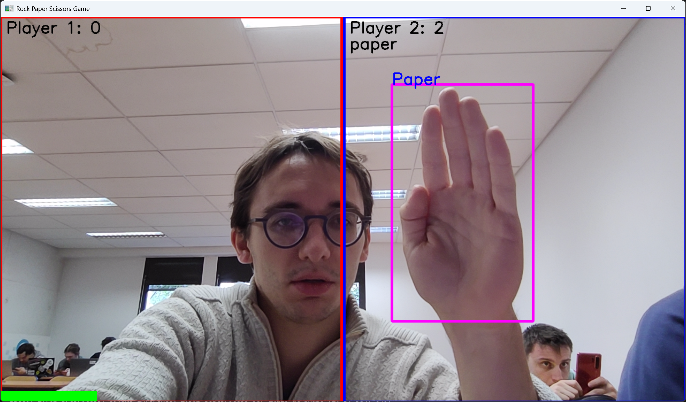
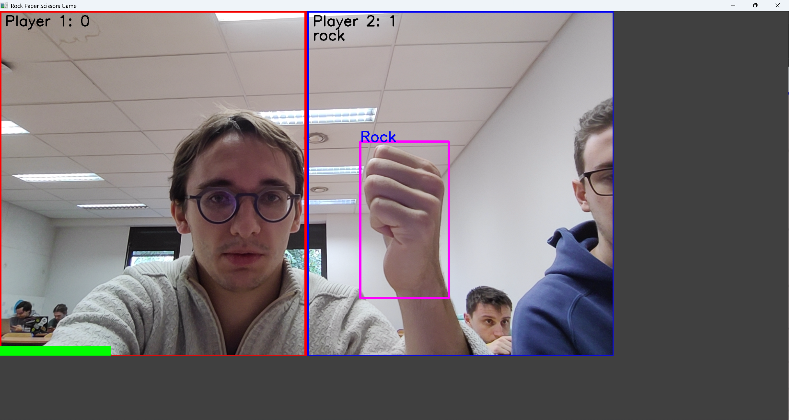
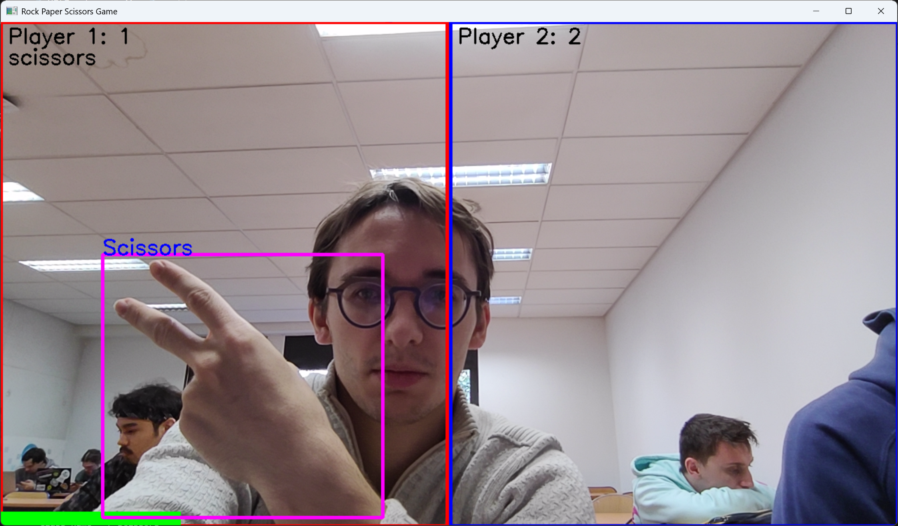
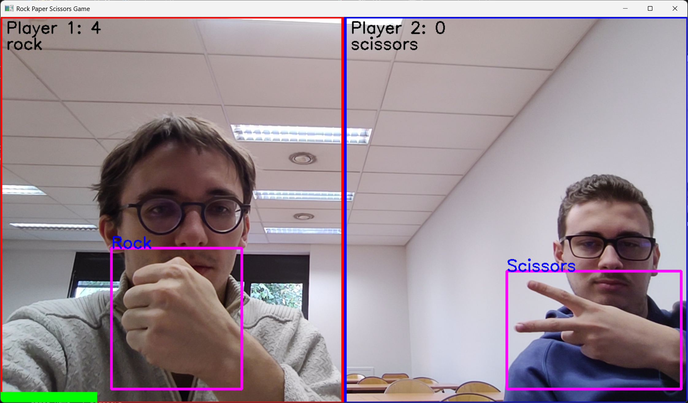

## Projet YOLO Gestures
BURDAIRON Florian BLUMET Thomas 5A Polytech Lyon (12/2024)
## Description
L'objectif a été de réutiliser le modèle de réseau de neurones YOLO (de type CNN) qui permet de faire de la classification et de la détection d'objets. Le modèle (en version 8) a été importé préentraîner. Dans notre objectif de réaliser de la détection de gestes, notamment ceux du jeu Pierre-Papier-Ciseaux, nous avons fine-tuné le modèle en le réentraînant (avec différentes valeurs d'epochs notamment, et une valeur de batch fixé à 8).
Pour ce faire, nous avons utilisé le site Roboflow qui permet d'importer des datasets d'images déjà détourées et annotées. Dans notre cas, nous avons importé un dataset existant d'images associé au jeu (cf https://universe.roboflow.com/roboflow-58fyf/rock-paper-scissors-sxsw/dataset/11). 

## Aperçu visuel

### Vidéo de démonstration

### Exemple classification

| Gesture                       | Image                                                                         |
|-------------------------------|-------------------------------------------------------------------------------|
| Paper                         |        |
| Rock                          |          |
| Scissors                      |  |
| 2 detections at the same time |                            |

## Lancement du projet
Il y a 2 possibilités de lancement :
- via le fichier [`YOLO_webcam.ipynb`](YOLO_webcam.ipynb) permettant l'éxecution pas à pas du code et l'affichage des logs d'éxecution,
- ou via le fichier [`YOLO_webcam.py`](YOLO_webcam.py) qui contient l'entièreté du code du projet permettant une exécution simplifiée.

### Besoin du projet

Pour ce projet, nous avons utilisé plusieurs librairies python :
- Ultralytics : pour l'utilisation de YOLO
- Roboflow : pour l'importation du jeu de données
- Torch : pour l'entrainement du modèle (avec CUDA)
- OpenCV : pour l'utilisation de la webcam
- YAML : pour la lecture du fichier de description du jeu de données

> Remarque : \
> Pour réaliser l'entraînement, il faut importer la librairie Torch CUDA et posséder une carte graphique Nvidia. \
> L'utilisation des modèles que nous avons déjà entrainé (`model/`) ne nécessite pas l'utilisation de CUDA.
