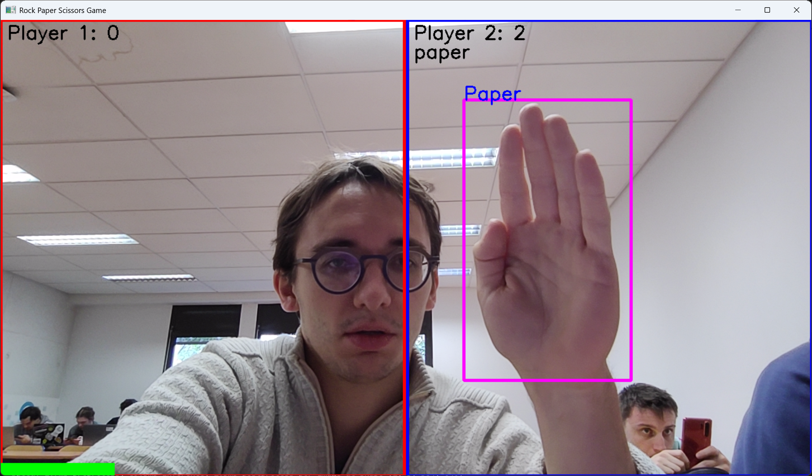
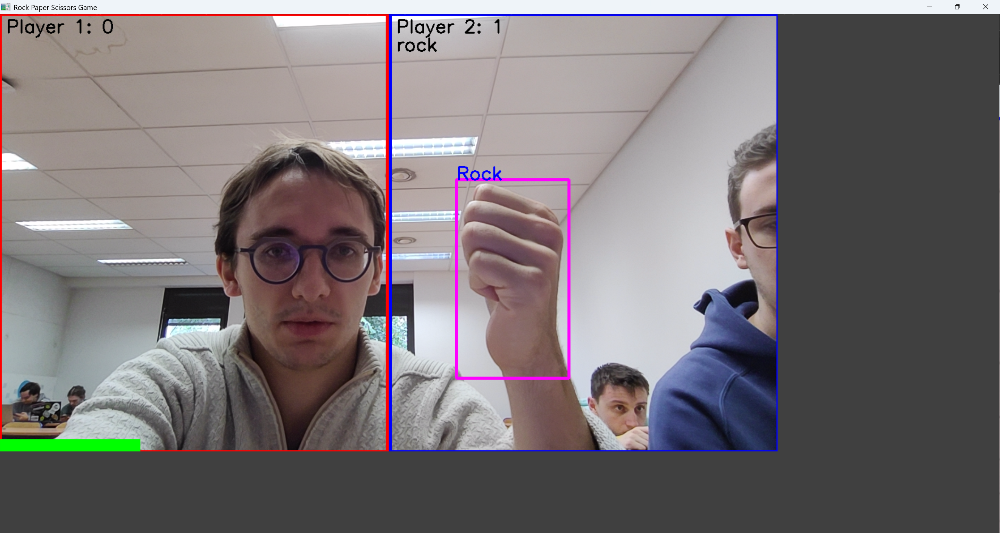
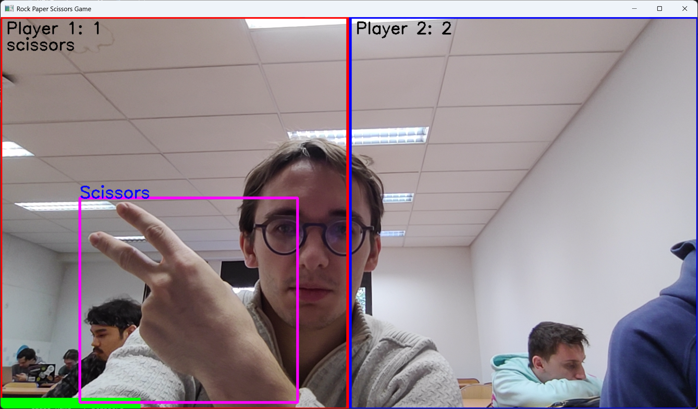
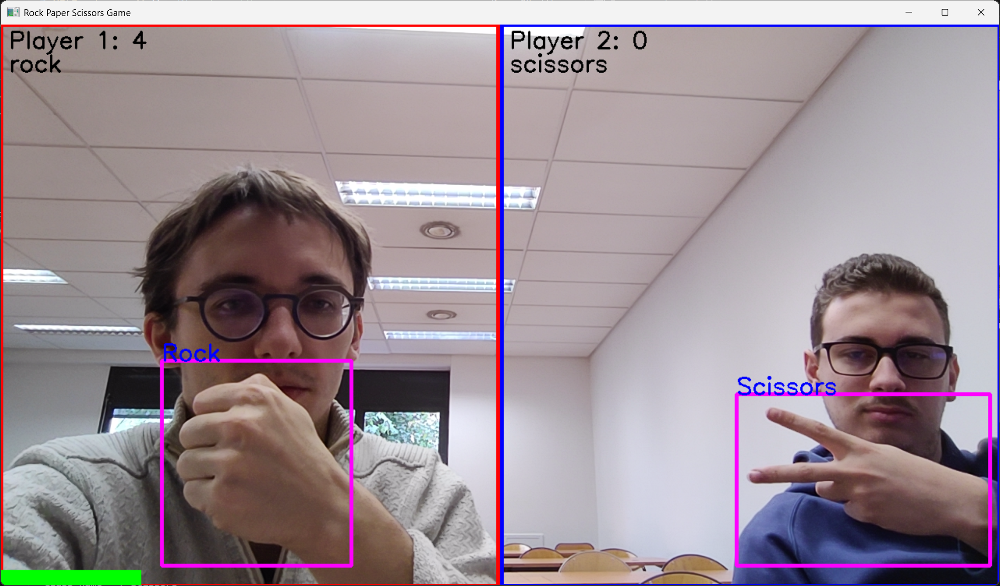

## Projet YOLO Gestures
BURDAIRON Florian BLUMET Thomas 5A Polytech Lyon (11/2024)
## Description
L'objectif a été de réutiliser le modèle de réseau de neurones YOLO (de type CNN) qui permet de faire de la classification et de la détection d'objets. Le modèle (en version 8) a été importé préentraîner. Dans notre objectif de réaliser de la détection de gestes, notamment ceux du jeu Pierre-Feuille-Ciseau, nous avons fine-tuné le modèle en le réentraînant (avec différentes valeurs d'epochs notamment, et une valeur de batch fixé à 8).
Pour ce faire, nous avons utilisé le site Roboflow qui permet d'importer des datasets d'images déjà détourées et annotées. La possibilité est aussi donné de pouvoir créer soi-même son dataset en important des images et en utilisant le logiciel intégré au site pour le détourage et l'annotation. Dans notre cas, nous avons importé un dataset existant d'images associé au jeu (cf https://universe.roboflow.com/roboflow-58fyf/rock-paper-scissors-sxsw/dataset/11 ). 

## Lancement du projet
En exécutant le fichier `YOLO_webcam.py`, la webcam du pc s'allume et il apparaît à l'écran une fenêtre séparée par 2 cadres couleurs. Chaque joueur joue alors son coup en se plaçant bien devant la caméra, plutôt de profil. L'algorithme détecte alors le geste de chaque joueur et les traite afin de désigner le gagnant de la partie en cours (incrémentant au passage le compteur de victoire accoller au nom du joueur). À noter : dès que la détection se réalise, le cadre s'affiche pendant un certain temps puis disparaît. En effet la détection est stoppée, ceci afin que le joueur ne change de geste en cours de partie, dont la durée est représentée visuellement par une barre de progression latérale en bas de la fenêtre de webcam.

## Aperçu visuel

### Vidéo de démonstration

### Exemple classification

| Gesture                   | Image                                                                         |
|---------------------------|-------------------------------------------------------------------------------|
| Paper                     |        |
| Rock                      |          |
| Scissors                  |  |
| A round with 2 detections |                            |